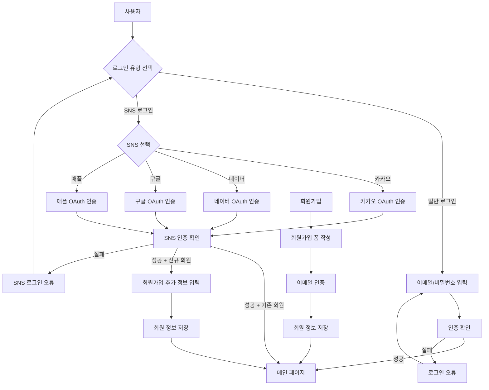
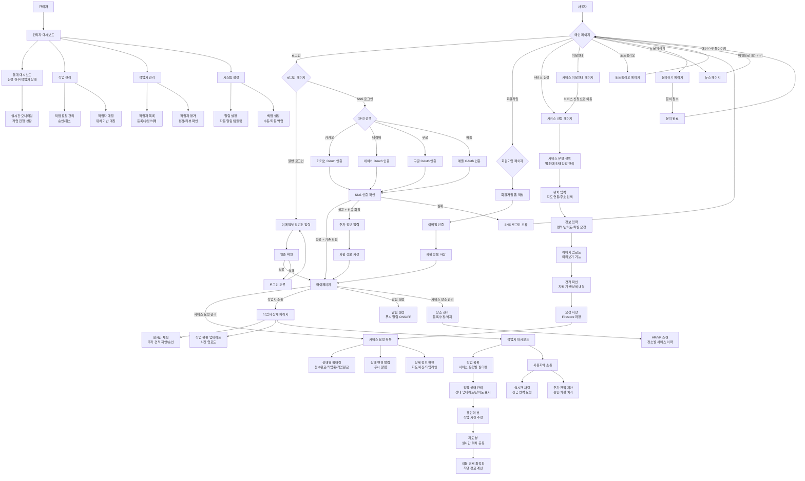

# 원스톱 벌초 플랫폼 개발 계획

## 최근 변경사항 (2025-05-10)
- 개인정보 처리방침 업데이트
  - 원스톱벌초(주식회사 메타아이엠) 개인정보 처리방침 내용 업데이트
  - 개인정보 수집 및 이용 목적 상세화
  - 개인정보 보유기간 및 파기절차 명시
  - 개인정보 보호책임자 정보 추가
  - 권익침해 구제방법 상세화
  - 2025년 4월 시행 예정

## 최근 변경사항 (2025-05-09)
- Firebase SDK 버전 통일 (11.5.0):
  - 현재 사용 중인 다양한 버전(8.10.1 ~ 11.5.0)을 최신 버전 11.5.0으로 통일
  - 수정 대상 파일:
    - mypage.html (8.10.1 → 11.5.0)
    - index.html (8.10.1 → 11.5.0)
    - admin-workers.html (9.6.0 → 11.5.0)
    - news.js (9.6.0 → 11.5.0)
    - login.html (9.6.1 → 11.5.0)
    - signup.html (10.8.0 → 11.5.0)
    - guide.js (10.8.0 → 11.5.0)
    - mypage.js (10.8.1 → 11.5.0)
    - worker-signup.html (10.12.0 → 11.5.0)
  - 목적:
    - API 일관성 유지
    - 최신 기능 및 보안 업데이트 활용
    - 버전 불일치로 인한 문제 방지
  - 결과: 모든 페이지에서 동일한 Firebase SDK 버전 사용

### 1. 메인 페이지 초기화 개선
- Firebase 모듈 시스템 적용
- 페이지 초기화 로직 개선
- 통계 업데이트 기능 개선
- 인증 상태 감지 추가

### 2. Firebase 설정 업데이트
- Firebase API 키 및 프로젝트 설정 복구
- 실제 프로젝트 설정으로 업데이트
- 인증 오류 해결

### 3. Google 로그인 기능 개선
- Google 로그인 버튼 스타일 개선
- 구체적인 에러 메시지 처리 추가
- 로그인 상태 표시 개선
- 팝업 차단 및 취소 처리 추가

### 4. 로그인 기능 개선
- 로그인 폼 DOM 요소 ID 추가
- Google 로그인 버튼 추가 및 스타일링
- DOM 로드 완료 후 스크립트 실행으로 변경
- 에러 처리 및 사용자 피드백 개선

### 5. Firestore 설정 업데이트
- enableIndexedDbPersistence를 새로운 방식으로 대체
- persistentLocalCache와 persistentMultipleTabManager 사용
- 오프라인 지속성 지원 개선

### 6. 로그인 스크립트 개선
- 중복된 로그인 스크립트 제거
- 모듈 기반 로그인 로직으로 통합
- 에러 처리 및 사용자 피드백 개선

### 7. Firebase 초기화 및 설정 개선
- Firestore 설정 방식 업데이트 (settings() → enableIndexedDbPersistence)
- Firebase 초기화 완료 이벤트 시스템 도입
- 오프라인 지속성 지원 추가
- 초기화 대기 로직 개선

### 8. JavaScript 모듈 시스템 적용
- 모든 JavaScript 파일을 ES 모듈 형식으로 변환
- script 태그에 type="module" 속성 추가
- Firebase SDK 모듈 import 방식 개선
- 인증 관련 코드 모듈화 및 재구성

### 9. 모든 Firebase SDK 버전을 11.5.0으로 통일
- 모듈 import 방식 개선
- Firebase 초기화 로직 개선

### 10. 네비게이션 바 수정
- 네비게이션 바 컨테이너 ID 불일치 수정 (navbar-container → navbar-placeholder)
- 네비게이션 바 초기화 로직 개선
- 모바일 프로필 섹션 동적 업데이트 기능 추가

### 11. 인증 로직 개선
- 로그인 오류 분석
- 인증 프로세스 개선
- 세션 관리 강화

## 최근 변경사항 (2025-05-08)
- request.html 지도 기능 복구:
  - 카카오맵 초기화 코드 개선
    - 불필요한 인터벌 체크 제거
    - SDK 로드 확인 로직 단순화
    - 중복 선언된 변수 제거
  - 지도 컨테이너 스타일 최적화
  - 결과: 지도가 정상적으로 표시됨

## 최근 변경사항 (2025-05-05)
- 네비게이션과 푸터 구조 명확화:
  - 네비게이션 구조:
    - HTML 컨테이너: `<div id="navbar-placeholder"></div>`
    - 스크립트: `scripts/navbar.js`
    - 로드 방식: 동적 로드 (스크립트에서 HTML 내용 삽입)
  - 푸터 구조:
    - HTML 컨테이너: `<div id="footer-placeholder"></div>`
    - HTML 파일: `components/footer.html`
    - CSS 파일: `components/footer.css`
    - 스크립트: `components/footer.js`
    - 로드 방식: 동적 로드 (스크립트에서 HTML 내용 삽입)
  - 경로 참조 규칙:
    - HTML 파일에서: 상대 경로 사용 (예: `components/footer.js`)
    - 스크립트 내에서: 상대 경로 사용 (예: `components/footer.html`)
    - Firebase 호스팅: legacy 폴더가 루트로 배포됨을 고려한 경로 설정

## 최근 변경사항 (2025-05-04)
- 네비게이션 업데이트: 요금 안내 메뉴(pircing.html) 제거 및 관련 링크 정리

## 최근 변경사항 (2025-05-03)
- footer 디자인 개선:
  - App Store/Google Play 다운로드 로고 제거
  - 밝은색 스타일 적용(배경 #ffffff, 텍스트 #343a40, 상단 테두리 #e9ecef, 섀도우 추가)
  - 링크 기본 색상 변경(#007bff), 호버 색상 변경(#0056b3)
  - SNS 아이콘 테두리 스타일 적용, 크기 조정 및 호버 시 배경 변경

## 최근 변경사항 (2025-04-18)
- 파일 경로 참조 방식 수정 및 통일
  - Firebase 호스팅 설정에서 legacy 폴더가 루트로 배포되는 점 고려하여 경로 수정
  - 절대 경로(`/legacy/components/...`) 대신 상대 경로(`components/...`) 사용으로 변경
  - 주요 수정 파일:
    - `login.html`: 네비게이션과 푸터 스크립트 경로 수정
      - `/legacy/scripts/navbar.js` → `scripts/navbar.js`
      - `/legacy/components/footer.js` → `components/footer.js`
    - `components/footer.js`: HTML 및 CSS 참조 경로 수정
      - `/legacy/components/footer.html` → `components/footer.html`
      - `/legacy/components/footer.css` → `components/footer.css`
  - 루트 디렉토리의 components 폴더 삭제 및 통합
  - 불필요한 중복 파일(scripts/footer.js) 정리
  - 결과: 로그인 페이지에서 네비게이션과 푸터가 정상적으로 표시됨
- 경로 참조 규칙 확립
  - 모든 HTML 파일에서 스크립트/스타일 참조 시 상대 경로 사용
  - 스크립트 내에서 리소스 로드 시에도 상대 경로 사용
  - 모든 푸터 관련 파일은 legacy/components 디렉토리에서 일원화하여 관리

## 최근 변경사항 (2025-04-17)
- 푸터 관련 파일 통합 및 정리
  - 루트 폴더의 components/footer.* 파일들을 legacy/components/ 디렉토리로 통합
  - 푸터 CSS 파일 통합 (두 개의 스타일 파일을 하나로 병합)
  - 푸터 JS 파일 기능 개선 (카테고리 토글 기능 추가)
  - 경로 참조 일원화 (/legacy/components/footer.html)
  - 코드 모듈화 및 재사용성 향상

## 최근 변경사항 (2025-04-16)
- request.html 지도 기능 개선
  - 지도 컨테이너 스타일 수정 (전체 영역 차지하도록)
  - 지도 초기화 코드 개선
    - 위성사진(하이브리드) 모드로 초기화
    - 지도 컨트롤 추가 (지도 유형 전환, 줌)
    - 윈도우 리사이즈 이벤트 처리 추가
  - 주소 검색 기능 개선
    - 주소 선택 시 자동으로 지도 중심 이동
    - 마커 및 인포윈도우 표시
    - 마커 드래그 기능 추가
- 공통 컴포넌트 시스템 구현
  - 모든 페이지에서 동일한 네비게이션과 푸터 사용
  - `components/load-components.js` 파일 생성 및 구현
    - 네비게이션과 푸터 동적 로드
    - 스타일과 스크립트 자동 로드
    - 상대 경로 사용하여 컴포넌트 참조
  - 각 페이지에 공통 컴포넌트 로드 코드 추가
    - 메인: index.html
    - 서비스 관련:
      - service_info.html
      - request.html
      - rerequest.html
      - pricing.html
      - portfolio.html
    - 사용자 관련:
      - login.html
      - signup.html
      - mypage.html
    - 작업자 관련:
      - worker.html
      - worker-signup.html
      - worker-list.html
      - worker-detail.html
    - 관리자 관련:
      - admin.html
      - admin-dashboard.html
      - admin-workers.html
      - admin-requests.html
      - admin-settings.html
    - 기타:
      - news.html
      - contact.html
      - terms.html
      - privacy.html
  - 푸터 디자인 개선 (숨고와 크몽 스타일 참고)
  - 모바일 최적화 및 카테고리 토글 기능 추가
- 네비게이션 시스템 통일
  - 모든 페이지에서 동일한 네비게이션 컨테이너 ID 사용 (`navbar-placeholder`)
  - 모든 페이지에서 동일한 스크립트 경로 사용 (`scripts/navbar.js`)
  - 수정된 파일:
    - worker.html
    - portfolio.html
    - worker-signup.html
    - login.html
  - 네비게이션 로드 실패 시 임시 메시지 표시 기능 추가

## 최근 변경사항 (2025-05-06)
- 카카오맵 기능 개선:
  - SDK 로딩 방식 개선
    - 비동기 로딩 적용
    - 에러 핸들링 추가
  - 지도 초기화 로직 개선
    - 컨테이너 스타일 최적화
    - 지도 타입 및 컨트롤 설정
    - 윈도우 리사이즈 대응
  - 주소 검색 기능 강화
    - 자동 중심 이동
    - 마커 및 인포윈도우 표시
    - 드래그 기능 추가
  - 서비스 타입 선택 로직 개선
    - 필수 필드 검증
    - 에러 메시지 표시
    - 폼 제출 처리 개선

## 최근 변경사항 (2025-05-07)
- 마이페이지 서비스 신청 내역 표시 개선:
  - 실제 데이터베이스 구조에 맞게 표시 필드 수정
  - 신청자 정보, 면적, 묘 정보 등 상세 정보 표시
  - 묘 유형 한글 표시 기능 추가
  - 결과: 서비스 신청 내역이 정상적으로 표시됨
- 마이페이지 스크립트 로드 순서 수정:
  - Bootstrap JS 추가
  - 스크립트 로드 순서 최적화
  - 결과: 서비스 신청 내역이 정상적으로 표시됨

## 최근 변경사항 (2025-03-21)
- 뉴스 페이지 SEO 최적화
  - 메인 키워드: "벌초", "예초", "벌초대행"
  - 지역 키워드: 시/군/구 단위로 확장 (예: "서울 강남구", "부산 해운대구")
  - 조합 키워드: "서울 강남구 벌초", "부산 해운대구 예초" 등
  - 카테고리 재구성: 트렌드, 전문가 팁, 지역 뉴스
  - 구조화된 데이터 개선
  - 결과: 구글 검색에서 벌초/예초 관련 키워드 검색 시 노출 개선

### 푸터 컴포넌트 수정
- 고객센터 정보 업데이트:
  - 전화번호: 1555-1487
  - 운영시간: 평일 09:00 - 18:00 (점심시간 12:00 - 13:00 제외 · 주말/공휴일 제외)
  - 이메일: metaim@naver.com
- 서비스 메뉴 구조 개선:
  - 홈
  - 서비스 신청
  - 서비스 이용안내
  - 뉴스
  - 문의하기
- 회사 정보 업데이트:
  - 회사명: 메타아이엠
  - 서비스명: 원스톱 벌초
  - 대표: 주명호
  - 사업자등록번호: 812-87-03681
  - 통신판매업 신고번호: 제 2025-4450149-30-2-00021호
  - 주소: 충청북도 진천군 덕산읍 예지1길 3-1 3층
  - 전화: 1555-1487
- 저작권 정보 업데이트:
  - © 2025 메타아이엠. All rights reserved.

### 페이지 복구 및 구조 개선
- request.html 복구 완료
  - 네비게이션과 푸터 컨테이너 추가
  - 서비스 신청 폼 구조화
  - 필요한 스크립트 연결
- mypage.html 복구 완료
  - 네비게이션과 푸터 컨테이너 추가
  - 사용자 프로필 섹션 구조화
  - 서비스 신청 내역 섹션 개선
  - 필요한 스크립트 연결

## 프로젝트 구조

### 1. 메인 페이지 (index.html)
- 홈페이지 레이아웃
- 서비스 소개
- 포트폴리오 섹션
- 문의하기 섹션

### 2. 서비스 가이드 페이지
- 벌초 서비스 (grave-cleaning.html)
- 예초 서비스 (grass-cutting.html)
- 태양광 관리 (solar-maintenance.html)

### 3. AI 상담 페이지 (ai-assistant.html)
- AI 챗봇 인터페이스
- 상담 기록 관리

### 4. 뉴스 페이지 (news.html)
- 서비스 관련 뉴스
- 업데이트 정보

### 5. 문의하기 페이지 (contact.html)
- 문의 폼
- 연락처 정보

### 6. 공통 컴포넌트
- 네비게이션 
  - HTML (components/nav.html)
  - JavaScript (components/nav.js)
- 푸터
  - HTML (legacy/components/footer.html)
  - CSS (legacy/components/footer.css)
  - JavaScript (legacy/components/footer.js)

### 7. 스타일시트
- 공통 스타일 (styles/common.css)
- 가이드 스타일 (styles/guide.css)
- 메인 스타일 (styles/styles.css)

### 8. 스크립트
- 메인 스크립트 (js/main.js)
- 가이드 스크립트 (js/guide.js)
- AI 상담 스크립트 (js/ai-assistant.js)
- 공통 컴포넌트 스크립트
  - 네비게이션 (components/nav.js)
  - 푸터 (components/footer.js)

### 9. 이미지
- 로고파일 경로 images/mainlogo.webp
- 서비스 이미지
- 포트폴리오 이미지

## 프로젝트 비전
- 기존 웹앱(legacy)의 기능을 개선하고 안정화하여 사용자 경험을 향상
- 웹앱을 기반으로 하여 안드로이드, iOS 앱을 개발하여 플랫폼 확장
- 모든 플랫폼에서 일관된 사용자 경험 제공
- 콘텐츠 자동화 시스템 구축으로 운영 효율성 향상

## 플랫폼 구조 요약
- 페이지 (legacy 디렉토리)
  - index.html: 메인 페이지
  - service_info.html, request.html, rerequest.html, pricing.html, portfolio.html: 서비스 관련
  - login.html, signup.html, mypage.html: 사용자 관련
  - worker.html, worker-signup.html, worker-list.html, worker-detail.html: 작업자 관련
  - admin.html, admin-dashboard.html, admin-workers.html, admin-requests.html, admin-settings.html: 관리자 관련
  - news.html, contact.html, terms.html, privacy.html: 기타
- 공통 컴포넌트
  - scripts/navbar.js: 네비게이션 로드
  - legacy/components/footer.html, legacy/components/footer.css, legacy/components/footer.js: 푸터
- 스크립트 (scripts 디렉토리)
  - firebase-config.js, auth.js, index.js 등 공통 로직
- 스타일 (styles 디렉토리)
  - common.css, guide.css, styles.css
- 이미지 (images 디렉토리)
- 백엔드 (functions 디렉토리)
- 문서 (docs 디렉토리)

## 0. 작업 상태 추적
### 중요: 모든 개발 작업은 다음 규칙을 따라야 합니다
1. 작업 시작 전
   - 개발 계획에서 해당 작업의 현재 상태 확인
   - 작업 완료 후 예상 상태 기록

2. 작업 중
   - 작업 내용을 상세히 기록
   - 예상 완료 시간 기록
   - 발생한 문제점 기록

3. 작업 완료 후
   - 개발 계획 파일 즉시 업데이트
   - 완료된 작업 체크
   - 다음 작업 단계 확인

4. 작업 중단 시
   - 현재까지의 진행 상황 기록
   - 중단된 작업 상태 표시
   - 다음 작업 재개 시 필요한 정보 기록

### 현재 작업 상태 (2024-04-09 기준)
- [ ] 마이페이지 기능 개선
  - 진행 중인 작업: 서비스 요청 상태 관리 개선
  - 완료된 작업: 
    - 상태별 시각적 표시 스타일 추가 (mypage.css)
    - 상태별 색상 및 아이콘 정의
    - 상태 변경 애니메이션 추가
  - 다음 작업: 상태 변경 이력 추적 기능 구현
  - 예상 완료 시간: 2024-04-12

- [ ] 작업자/관리자 페이지 기능 개선
  - 진행 중인 작업: 작업자 대시보드 UI 개선
  - 완료된 작업: 작업 일정 캘린더 기본 기능
  - 다음 작업: 실시간 작업 상태 업데이트
  - 예상 완료 시간: 2024-04-15

- [ ] SNS 로그인 문제 해결
  - 진행 중인 작업: 카카오 로그인 오류 분석
  - 완료된 작업: 로그인 상태 유지 개선
  - 다음 작업: 세션 관리 강화
  - 예상 완료 시간: 2024-04-10

- [ ] 스타일 파일 개발
  - 진행 중인 파일: login.css
  - 완료된 작업: mypage.css 기본 스타일
  - 다음 작업: 반응형 디자인 적용
  - 예상 완료 시간: 2024-04-14

### 개발 환경 설정
1. 설치된 도구 및 경로
   - Git
     - 설치 경로: C:\Program Files\Git
     - 설치 날짜: 2024-03-20
     - 버전: 2.44.0.windows.1
   
   - Node.js
     - 설치 경로: C:\Program Files\nodejs
     - 설치 날짜: 2024-03-20
     - 버전: 18.19.1
   
   - Python
     - 설치 경로: C:\Users\user\AppData\Local\Programs\Python\Python39
     - 설치 날짜: 2024-03-20
     - 버전: 3.9.0
   
   - Firebase CLI
     - 설치 경로: C:\Users\user\AppData\Roaming\npm
     - 설치 날짜: 2024-03-20
     - 버전: 12.11.1

2. 개발 환경 설정
   - 작업 디렉토리: C:\onestop_platform
   - Git 저장소: legacy/
   - Firebase 프로젝트: onestop-platform
   - 배포 URL: https://onestop-platform.web.app

## 1. 프로젝트 개요
- 프로젝트명: OneStop Platform
- 목적: 서비스 신청 및 작업 관리 플랫폼
- 주요 기능: 서비스 신청, 작업자 관리, 작업 진행 상태 추적

## 2. 현재 개발 상태
### 2.1 완료된 기능
- 기본 서비스 신청 프로세스 구현
- 작업 상태 관리 시스템 (접수완료, 작업확인, 작업중, 작업완료)
- 작업자 대시보드 구현
- 위치 기반 서비스 매칭
- Firebase 연동 (인증, 데이터베이스, 스토리지)
- 알림 시스템 기본 구현

### 2.2 진행 중인 기능
- 실시간 작업 상태 업데이트
- 작업자 배정 시스템
- 작업 로그 기록 시스템
- 마이페이지 기능 개선
  - 서비스 요청 상태 관리
  - 상세 정보 표시
  - 알림 시스템
  - 추가 비용 관리
- 작업자/관리자 페이지 기능 개선
  - 작업자 대시보드 개선
  - 관리자 기능 확인 및 개선
- SNS 로그인 문제 해결
  - 로그인 오류 분석
  - 인증 프로세스 개선
- 스타일 파일 개발
  - 새로운 페이지 구현을 위한 스타일
    - 로그인 관련 (`login.css`, `register.css`, `find-password.css`)
    - 이용약관 및 개인정보처리방침 (`terms.css`, `privacy.css`)
  - 기존 페이지 스타일 개선
    - 마이페이지 관련 (`mypage.css`, `service-request.css`)
- [x] My Page 기능 개선
  - [x] 서비스 요청 상태 관리 개선
  - [x] 상태 변경 이력 추적 기능
  - [x] 작업자 소통 기능 구현
    - [x] 실시간 채팅 기능
    - [x] 추가 견적 승인/거절
    - [x] 작업 현황 업데이트
    - [x] 추가 요청 기능

## 3. 향후 개발 계획
### 3.1 단기 목표 (1-2개월)
- [ ] 사용자 인증 시스템 개선
  - SNS 로그인 안정화
  - 2단계 인증 추가
  - 세션 관리 강화
- [ ] 작업자 평가 시스템 구현
  - 평점 시스템
  - 리뷰 작성 기능
  - 신고 시스템
- [ ] 실시간 알림 시스템 추가
  - 푸시 알림 최적화
  - 알림 설정 개인화
  - 알림 기록 관리
- [ ] 모바일 반응형 디자인 최적화
  - 푸터 디자인 스타일 숨고 및 크몽 푸터 참조
  - 모바일 UI/UX 개선
  - 성능 최적화
  - 오프라인 지원
- [ ] 서비스 요청 상태 관리 개선
  - 상태별 시각적 표시 (색상, 아이콘)
  - 상태 변경 이력 추적
  - 상태 변경 알림
- [ ] 서비스 상세 정보 표시 개선
  - 지도 연동
  - 사진 갤러리
  - 진행 상황 타임라인
- [ ] 추가 비용 관리 시스템 개선
  - 견적 상세 내역
  - 승인/거절 프로세스
  - 수정 요청 프로세스
- [ ] 작업자 소통 기능 구현
  - 실시간 채팅 기능
  - 추가 견적 승인/거절
  - 긴급 연락 요청
  - 추가 서비스 신청
  - 작업 진행 상황 공유
  - 파일 공유 기능
  - 알림 설정 관리

### 3.2 중기 목표 (3-6개월)
- [ ] 안드로이드 앱 개발
  - 웹뷰 기반 앱 개발
  - 네이티브 기능 통합
  - 푸시 알림 구현
- [ ] iOS 앱 개발
  - 웹뷰 기반 앱 개발
  - 네이티브 기능 통합
  - 푸시 알림 구현
- [ ] AI 기반 작업자 매칭 시스템
  - 작업자 성과 분석
  - 최적 매칭 알고리즘
  - 예측 분석
- [ ] 결제 시스템 통합
  - 다양한 결제 수단 지원
  - 자동 결제 시스템
  - 환불 프로세스

### 3.3 장기 목표 (6개월 이상)
- [ ] API 마켓플레이스 구축
  - 외부 개발자용 API
  - 문서화
  - 샌드박스 환경
- [ ] 분석 대시보드 개발
  - 실시간 통계
  - 예측 분석
  - 보고서 생성
- [ ] 자동화된 작업 스케줄링
  - AI 기반 스케줄링
  - 리소스 최적화
  - 예외 처리
- [ ] 확장성 있는 아키텍처 개선
  - 마이크로서비스 아키텍처
  - 컨테이너화
  - 자동 스케일링

## 4. 기술 스택
- 프론트엔드: HTML, CSS, JavaScript
- 백엔드: Firebase
- 데이터베이스: Firestore
- 스토리지: Firebase Storage
- 인증: Firebase Authentication
- 모바일: React Native (예정)

## 5. 리스크 관리
- 데이터 보안 및 개인정보 보호
- 시스템 확장성
- 실시간 기능의 안정성
- 사용자 경험 최적화

## 6. 팀 구성 및 역할
- 프론트엔드 개발자
- 백엔드 개발자
- UI/UX 디자이너
- 프로젝트 매니저

## 7. 마일스톤
- Q1: 웹앱 기능 개선 완료
- Q2: 안드로이드 앱 출시
- Q3: iOS 앱 출시
- Q4: 플랫폼 통합 및 최적화

## 8. 주간 업데이트
- 매주 금요일 개발 진행 상황 업데이트
- 주간 목표 설정 및 검토
- 이슈 트래킹 및 해결

## 9. 문서화
- API 문서
- 사용자 매뉴얼
- 개발 가이드라인
- 배포 프로세스

## 10. 공통 기능
- [x] 다크모드 기능 제외 (현재 사이트 디자인과의 일관성 유지)

## 페이지 간 연결 및 공유 기능
- 공통 컴포넌트
  - 네비게이션 (scripts/navbar.js): 모든 페이지 상단에 로드
  - 푸터 (components/footer.html, footer.css, footer.js): 모든 페이지 하단에 로드
  - 인증 스크립트 (scripts/auth.js): 로그인/회원가입/마이페이지 기능 공유
  - Firebase 초기화 (scripts/firebase-config.js): 모든 페이지 데이터 연동 설정
- 페이지 연결 구조
  - index.html → login.html, signup.html, request.html, service_info.html, portfolio.html, news.html, contact.html
  - login.html 성공 시 mypage.html, 실패 시 login.html
  - signup.html 성공 시 login.html
  - request.html 성공 시 mypage.html
  - mypage.html 요청 목록 클릭 시 request.html 또는 worker.html
  - worker-signup.html 성공 시 worker.html
  - worker.html 요청 클릭 시 request.html
  - admin.html → admin-dashboard.html
  - 서비스 관련 페이지 → request.html 링크 포함
  - 기타 페이지(news.html, contact.html, terms.html, privacy.html) → index.html 및 footer 링크
- 공유 기능
  - 공통 스타일 (styles/common.css)
  - 전화번호 자동 하이픈 입력, 입력 검증(form.js)
  - SNS 로그인 기능 공통 로직
  - 이미지 업로드 및 미리보기 컴포넌트

## 1. 페이지별 상세 개발 계획

### 1.1 서비스 요청 페이지 (request.html)
#### 현재 기능
- 서비스 유형 선택 (벌초, 예초, 태양광 예초, 가지치기)
- 상세 정보 입력
  - 위치 정보
  - 면적 정보
  - 작업 난이도
  - 특별 요청사항
- 이미지 업로드
- 견적 요청

#### 개선 필요 사항
- [ ] 서비스 유형별 필수 입력 항목 동적 변경
- [ ] 위치 정보 자동 완성 기능
- [ ] 면적 계산 도구 추가
- [ ] 이미지 미리보기 기능
- [ ] 견적 계산기 통합

#### 데이터 구조
```javascript
{
  serviceType: string,      // 서비스 유형
  location: {
    address: string,        // 주소
    coordinates: {          // 좌표
      lat: number,
      lng: number
    }
  },
  area: {
    size: number,           // 면적
    unit: string           // 단위
  },
  difficulty: string,       // 난이도
  specialRequests: string,  // 특별 요청사항
  images: string[],        // 이미지 URL 배열
  estimate: {
    basePrice: number,     // 기본 가격
    additionalCosts: {     // 추가 비용
      type: string,
      amount: number
    }[]
  }
}
```

### 1.2 작업자 회원가입 페이지 (worker-signup.html)
#### 현재 기능
- 회원가입 유형 선택(개인/사업자)
- 기본 정보 입력(이름, 이메일, 비밀번호, 전화번호)
- 사업자 정보 입력(사업자등록번호, 대표자명, 사업장 소재지, 세금계산서용 이메일)
- 작업 정보 입력(작업 가능 지역, 서비스 유형 선택)
#### 개선 필요 사항
- [ ] 입력값 유효성 검사 및 실시간 피드백
- [ ] 프로필 사진 업로드 기능
- [ ] SNS 로그인 연동
- [ ] 주소 자동완성 및 지도 연동 개선
#### 데이터 구조 예시
```javascript
{
  registrationType: string, // individual or business
  name: string,
  email: string,
  password: string,
  phone: string,
  businessNumber?: string,
  representative?: string,
  businessAddress?: string,
  taxEmail?: string,
  regions: string[],
  services: string[]
}
```

### 1.3 작업자 페이지 (worker.html)
#### 현재 기능
- 작업 목록 표시
- 작업 상태 관리
- 캘린더 뷰
- 지도 뷰

#### 개선 필요 사항
- [ ] 서비스 유형별 작업 필터링
- [ ] 작업 난이도 표시
- [ ] 작업 시간 추정
- [ ] 이동 경로 최적화
- [ ] 실시간 위치 공유

#### 데이터 연동
- request.html의 데이터 구조와 일치하도록 수정
- 작업 상태 변경 이력 추적
- 작업자 평가 시스템 연동

### 1.4 마이페이지 (mypage.html)
#### 현재 기능
- 서비스 요청 목록
- 작업 상태 확인
- 결제 내역
- 프로필 관리

#### 개선 필요 사항
- [ ] 서비스 장소 관리 기능
  - 장소 등록/수정/삭제
  - AR/VR 기반 장소 스캔
  - 장소별 서비스 이력 관리
  - 계절별 작업 추천
- [ ] AI 기반 예측 서비스
  - 장소별 자동 견적 계산
  - 계절별 작업 추천
  - 작업 시기 알림
  - 작업 난이도 예측
- [ ] 서비스 유형별 요청 필터링
- [ ] 상세 작업 진행 상황
- [ ] 작업자 평가 기능
- [ ] 알림 설정
- [ ] 결제 내역 상세

#### 데이터 구조
```javascript
{
  serviceLocations: [{
    id: string,
    name: string,
    type: string,           // 묘지, 산소, 정원 등
    location: {
      address: string,
      coordinates: {
        lat: number,
        lng: number
      }
    },
    scanData: {
      arScan: string,      // AR 스캔 데이터
      vrTour: string,      // VR 투어 데이터
      images: string[],    // 장소 이미지
      measurements: {      // 측정 데이터
        area: number,
        height: number,
        slope: number
      }
    },
    serviceHistory: [{
      date: string,
      serviceType: string,
      workerId: string,
      status: string,
      cost: number
    }],
    aiRecommendations: {
      nextServiceDate: string,
      recommendedServices: string[],
      estimatedCost: number,
      difficulty: string
    }
  }]
}
```

### 1.5 관리자 페이지 (admin.html)
#### 현재 기능
- 사용자 관리
- 작업 관리
- 통계 확인

#### 개선 필요 사항
- [ ] 서비스 유형별 통계
- [ ] 작업자 매칭 알고리즘
- [ ] 실시간 모니터링
- [ ] 보고서 생성

#### 데이터 연동
- 모든 페이지의 데이터 구조 통합
- 실시간 데이터 업데이트
- 통계 데이터 집계

## 2. 자동화 글쓰기 시스템

### 2.1 웹앱 내 자동화 글쓰기
#### 기능
- [ ] 작업 완료 보고서 자동 생성
- [ ] 견적서 자동 생성
- [ ] 알림 메시지 템플릿
- [ ] 이메일 자동 발송

#### 구현 단계
1. 템플릿 시스템 구축
2. 데이터 매핑 로직 구현
3. 문서 생성 엔진 개발
4. PDF 변환 기능 추가

### 2.2 네이버/워드프레스 자동화 글쓰기
#### 기능
- [ ] 블로그 포스팅 자동화
- [ ] SEO 최적화 콘텐츠 생성
- [ ] 이미지 자동 업로드
- [ ] 해시태그 자동 생성

#### 구현 단계
1. API 연동
2. 콘텐츠 생성 알고리즘 개발
3. 이미지 처리 시스템
4. 자동 발행 스케줄러

## 3. 공통 개선 사항

### 3.1 데이터 구조 통합
- 모든 페이지에서 동일한 데이터 구조 사용
- API 엔드포인트 표준화
- 데이터 검증 규칙 통일

### 3.2 사용자 경험 개선
- 일관된 UI/UX 제공
- 로딩 상태 표시
- 에러 처리 통일
- 접근성 개선

### 3.3 성능 최적화
- 이미지 최적화
- 코드 분할
- 캐싱 전략
- 지연 로딩

## 4. 개발 진행 상황

### 4.1 현재 작업 중 (2024-04-10)
- [ ] 관리자 페이지 개선
  - 진행 중인 작업: 
    - 누락된 JS 파일 생성
    - 사이드바 링크 수정
    - 이미지 파일 추가
  - 완료된 작업:
    - HTML 파일 구조 개선
    - 기본 기능 구현
  - 다음 작업: 
    - 실시간 데이터 업데이트 구현
    - 차트 기능 개선
  - 예상 완료: 2024-04-12

### 4.2 발견된 문제점
1. 파일 누락
   - JS 파일: admin-customers.js, admin-services.js, admin-payments.js, admin-settlements.js, admin-analytics.js, admin-ai.js, admin-monitoring.js, admin-integration.js
   - 이미지 파일: logo.png

2. 링크 오류
   - 사이드바 링크에서 .html 확장자 누락
   - 상대 경로 문제

3. 스타일시트 문제
   - main.css 파일 누락
   - admin.css 스타일 개선 필요

### 4.3 해결 방안
1. 파일 생성
   - 누락된 JS 파일 생성 완료
   - 이미지 파일 추가 예정

2. 링크 수정
   - 사이드바 링크에 .html 확장자 추가 완료
   - 상대 경로로 수정 완료

3. 스타일 개선
   - main.css 파일 생성 예정
   - admin.css 스타일 개선 예정

### 4.4 다음 작업
- [ ] 이미지 파일 추가
- [ ] 스타일시트 개선
- [ ] 실시간 데이터 업데이트 구현
- [ ] 차트 기능 개선

## 5. 주의사항
1. 모든 페이지 개발 시 request.html의 데이터 구조 고려
2. 사용자 입력 데이터 검증 강화
3. 에러 처리 및 로깅 시스템 구축
4. 보안 취약점 점검
5. 성능 모니터링

## 6. 작업 이력
### 2024-04-09
- 개발 계획 업데이트
- 현재 문제점 해결 계획 추가
- 단계별 개발 일정 수립

## 구현된 기능 ✅

### 1. 사용자 관리
- 사용자 등록/수정/삭제
- 권한 관리
- 사용자 활동 로그

### 2. 작업자 관리
- 작업자 등록/수정/삭제
- 작업자 상세 정보 관리
- 작업자 상태 관리

### 3. 고객 관리
- 고객 등록/수정/삭제
- 고객 상세 정보 관리
- 고객 이력 관리

### 4. 서비스 관리
- 서비스 등록/수정/삭제
- 서비스 카테고리 관리
- 서비스 상태 관리

### 5. 결제 관리
- 결제 처리
- 결제 내역 관리
- 환불 처리

### 6. 정산 관리
- 작업자 정산
- 정산 내역 관리
- 정산 보고서

### 7. 통계 및 분석
- 기본 통계
- 사용자 행동 분석
- 서비스 이용 분석

### 8. 차트 기능
- Chart.js 통합
- 다양한 차트 유형
- 실시간 데이터 업데이트

### 9. AI 분석
- 데이터 분석
- 예측 모델
- 추천 시스템

### 10. 시스템 모니터링
- Firebase 기본 모니터링 사용
- API 상태 확인
- 데이터베이스 상태 확인
- 서비스 상태 확인
- 오류 로그 관리

### 11. 시스템 설정
- 일반 설정
- 보안 설정
- 알림 설정
- 통합 설정
- 백업 설정

### 12. 시스템 통합
- 카카오 API 통합
- 결제 API 통합
- 지도 API 통합
- API 상태 모니터링
- 통합 로그 관리

### 13. 시스템 백업 및 복구
- 수동/자동 백업
- 백업 설정
- 복구 기능
- 백업 이력 관리

### 14. 시스템 로그 분석
- 로그 데이터 분석
- 시각화 기능
- 필터링 기능
- 보고서 기능

## 다음 진행 절차

### 1. 테스트 및 디버깅
- 각 기능별 단위 테스트
- 통합 테스트
- 성능 테스트
- 보안 테스트

### 2. 문서화
- API 문서 작성
- 사용자 매뉴얼 작성
- 개발 가이드라인 작성
- 배포 프로세스

### 3. 배포 준비
- 환경 설정
- 데이터 마이그레이션
- 백업 전략 수립
- 모니터링 설정

### 4. 운영 환경 구축
- 서버 설정
- 데이터베이스 설정
- 보안 설정
- 모니터링 시스템 구축

### 5. 유지보수 계획
- 정기 업데이트 계획
- 버그 수정 프로세스
- 기능 개선 계획
- 사용자 피드백 관리

python -m http.server 8000 

## 에뮬레이터 설정 정보

### 3.2 로컬 개발 환경
#### 에뮬레이터 설정
- Auth Emulator: 9099
- Firestore Emulator: 8080
- Storage Emulator: 9199
- Functions Emulator: 5001
- Hosting Emulator: 5000
- PubSub Emulator: 8085
- Eventarc Emulator: 9299
- DataConnect Emulator: 9399
- Tasks Emulator: 9499
- Emulator UI: 4000 

cd C:\onestop_platform
firebase emulators:start 

[Environment]::SetEnvironmentVariable("Path", $env:Path + ";C:\Program Files\Java\jdk-24\bin", "Machine") 

## 컴포넌트 참조 경로
### 네비게이션 컴포넌트
- 위치: `/components/nav.html`
- 참조 경로: `/components/nav.html`
- 사용 방법:
  ```javascript
  fetch('/components/nav.html')
    .then(response => response.text())
    .then(html => {
      document.getElementById('app-nav').innerHTML = html;
    });
  ```
- 컨테이너 ID: `app-nav`

### 푸터 컴포넌트
- 위치: `/components/footer.html`
- 참조 경로: `/components/footer.html`
- 사용 방법:
  ```javascript
  fetch('/components/footer.html')
    .then(response => response.text())
    .then(html => {
      document.getElementById('app-footer').innerHTML = html;
    });
  ```
- 컨테이너 ID: `app-footer`

### 주의사항
1. 모든 페이지에서 위의 참조 경로를 사용해야 합니다.
2. 컨테이너 ID는 반드시 `app-nav`와 `app-footer`를 사용해야 합니다.
3. `legacy` 폴더 내의 컴포넌트 파일은 사용하지 않습니다.
4. 상대 경로(`../components/`) 대신 절대 경로(`/components/`)를 사용합니다. 

## 네비게이션 경로 수정
- `legacy/scripts/nav.js`의 네비게이션 로드 경로를 절대 경로로 수정
  - 변경 전: `components/nav.html`
  - 변경 후: `/components/nav.html`
- 모든 페이지가 루트 폴더의 컴포넌트를 참조하도록 통일 

## 2024-03-21 업데이트
- Firebase 배포 완료
  - 호스팅 URL: https://onestop-88b05.web.app
  - 배포된 리소스:
    - Storage
    - Firestore
    - Functions
    - Hosting
  - 모든 관리자 페이지와 기능이 정상적으로 배포됨 

- index.html 네비게이션 수정
  - 네비게이션 컨테이너 위치 조정 (body 태그 바로 아래로 이동)
  - 스크립트 순서 최적화
  - 네비게이션 스크립트 추가
  - 네비게이션 컨테이너 ID를 app-nav로 변경
  - nav.js와의 일관성 확보
  - 네비게이션 스크립트 추가 (navbar.js) 

## 네비게이션 구조 (완료)
- 모든 페이지는 `navbar-placeholder` ID를 가진 div 요소를 사용하여 네비게이션을 표시합니다.
- 네비게이션은 `navbar.js`를 통해 동적으로 로드됩니다.
- 네비게이션 컨테이너는 고정 위치(fixed position)로 설정되어 있으며, 본문은 상단 패딩(60px)을 가집니다.
- 네비게이션의 z-index는 1000으로 설정되어 있어 다른 요소들 위에 표시됩니다.
- 네비게이션 구조는 일관성을 유지하기 위해 모든 페이지에서 동일하게 유지되어야 합니다.

### 주의사항
- 네비게이션의 기본 구조와 동작 방식은 변경하지 않습니다.
- 향후 디자인 변경이나 메뉴 추가가 필요한 경우에도 다음 사항은 유지해야 합니다:
  - `navbar-placeholder` ID 사용
  - `navbar.js`를 통한 동적 로드
  - 고정 위치(fixed position) 설정
  - 본문 상단 패딩(60px)
  - z-index 값(1000) 

## 푸터 구조 (완료)
- 모든 페이지는 `footer-container` ID를 가진 footer 요소를 사용하여 푸터를 표시합니다.
- 푸터는 `footer.js`를 통해 동적으로 로드됩니다.
- 푸터 구조는 일관성을 유지하기 위해 모든 페이지에서 동일하게 유지되어야 합니다.

### 주의사항
- 푸터의 기본 구조와 동작 방식은 변경하지 않습니다.
- 향후 디자인 변경이나 메뉴 추가가 필요한 경우에도 다음 사항은 유지해야 합니다:
  - `footer-container` ID 사용
  - `footer.js`를 통한 동적 로드
  - 푸터의 기본 레이아웃 구조 

## 회원가입 및 로그인 플로우


## 세부 기능 명세: 로그인/회원가입 시스템
- 일반 로그인 (이메일/비밀번호)
  - 입력값 검증(이메일 형식, 비밀번호 길이)
  - Firebase Auth 연동(signInWithEmailAndPassword)
  - 세션 관리(로컬 스토리지/쿠키)
  - 실패 시 에러 메시지 처리(auth/user-not-found, auth/wrong-password 등)
- 회원가입 (이메일/비밀번호)
  - 입력폼(이름, 전화번호, 이메일, 비밀번호, 비밀번호 확인)
  - 이메일 인증(sendEmailVerification)
  - 사용자 정보 저장(Firestore users 컬렉션)
  - 중복 이메일 처리(auth/email-already-in-use)
- SNS 로그인
  - 카카오, 네이버, 구글, 애플 OAuth 2.0
  - 인증 토큰 교환(Functions HTTPS Callable)
  - 신규/기존 사용자 구분 후 추가 정보 입력
- 비밀번호 재설정
  - 이메일 발송(sendPasswordResetEmail)
  - 성공/실패 피드백 처리
- 계정 찾기
  - 이름+전화번호로 Firestore 조회
  - 결과 피드백(가입 정보 또는 실패 메시지)
- UI/UX
  - 네비게이션 및 푸터 포함 공통 컴포넌트
  - 단계별 Form/모달 디자인
  - 로딩/에러 상태 표시

## 구현 로드맵: 단계별 계획
1. 환경 설정
   - Firebase 프로젝트 및 SDK 초기화
   - 공통 컴포넌트(navbar/footer) 로드 구조 점검
2. 이메일/비밀번호 회원가입 & 로그인
   - signup.html/signup.js, login.html/auth.js 구현
   - Firestore users 컬렉션 연동 및 UI 검증
3. 비밀번호 재설정 및 계정 찾기
   - reset-password, find-account 모달/폼 구현
   - 이메일 발송 및 Firestore 조회 로직
4. SNS 로그인 통합
   - 카카오/네이버/구글 OAuth 설정 및 redirect 핸들러 구현
   - Functions 토큰 교환 및 Firebase Auth signInWithCustomToken
5. 신규 사용자 추가 정보 입력
   - SNS 신규 회원 flow에 맞춘 추가 정보 폼
6. 보안 및 세션 관리 강화
   - CSRF/XSS 방어, 쿠키 정책 준수
   - 로그인 유지(세션 지속성) 최적화
7. 테스트 및 배포
   - 유닛/통합 테스트 작성
   - Firebase Hosting 배포 및 모니터링 설정 

## 원스톱 벌초 플랫폼 설계 계획
### 플로우차트

### 설계 계획 요약
- 로그인/회원가입: 기존 흐름도를 반영하여 사용자 인증 처리.
- 서비스 신청 페이지: 지도 연동, 이미지 업로드, 견적 계산 등 세부 기능 포함.
- 마이페이지: 요청 관리, 작업자 소통, 알림 설정, 장소 관리 기능 상세화.
- 작업자 페이지: 작업 관리 및 사용자 소통 기능 구체화.
- 어드민 페이지: 통계, 모니터링, 작업/작업자 관리, 시스템 설정 포함.

## 1. 프로젝트 개요
원스톱 플랫폼은 다양한 서비스를 제공하는 통합 플랫폼입니다.

## 주요 기능
1. 사용자 인증 및 권한 관리
2. 서비스 요청 및 관리
3. 리뷰 시스템
4. 뉴스 수집 및 표시

## 2024-03-15 업데이트
- 서비스 신청 페이지 개선
  - 비회원 서비스 신청 기능 추가
  - 로그인 체크 로직 완전 제거
  - 인증 상태 확인 스크립트 제거
  - 고객 정보 직접 입력 방식으로 변경
  - 관리자 알림 기능 개선
  - 비로그인 필수 페이지 목록에 request.html 추가
  - 단계별 폼 구조 유지
  - 카카오맵 SDK 로드 방식 개선
  - 푸터 로드 오류 수정
  - 단계별 폼 처리 로직 개선
  - 다음/이전 버튼 이벤트 핸들러 추가
  - 단계별 유효성 검사 추가
  - 진행률 표시 기능 개선
  - 카카오맵 기능 개선
    - 위성사진 모드로 초기화
    - 주소 검색 기능 개선
    - 마커 드래그 기능 추가
    - 좌표값 자동 저장
    - 지도 표시 영역 개선
    - 지도 리사이즈 이벤트 추가
    - 지도 초기화 로직 개선
    - 브라우저 배율 변경 이벤트 추가

## 최근 변경사항

### 2024-04-XX
- 푸터 개선
  - 회사 정보 섹션에 개인정보 처리방침과 이용약관 링크 추가
  - 링크 스타일 적용 (호버 효과, 구분자 등)
  - 모바일 환경에서의 레이아웃 최적화